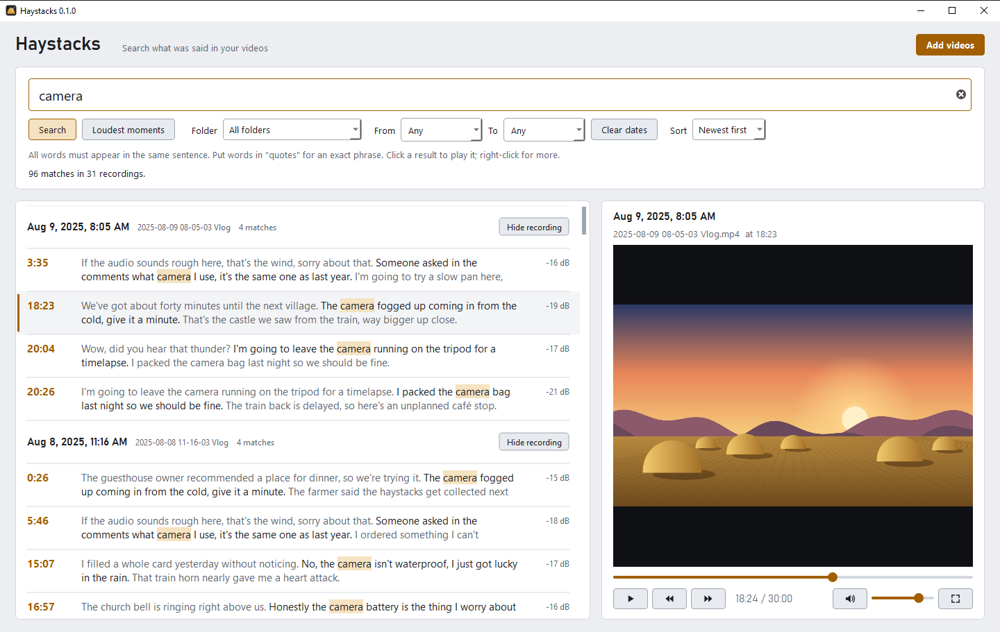
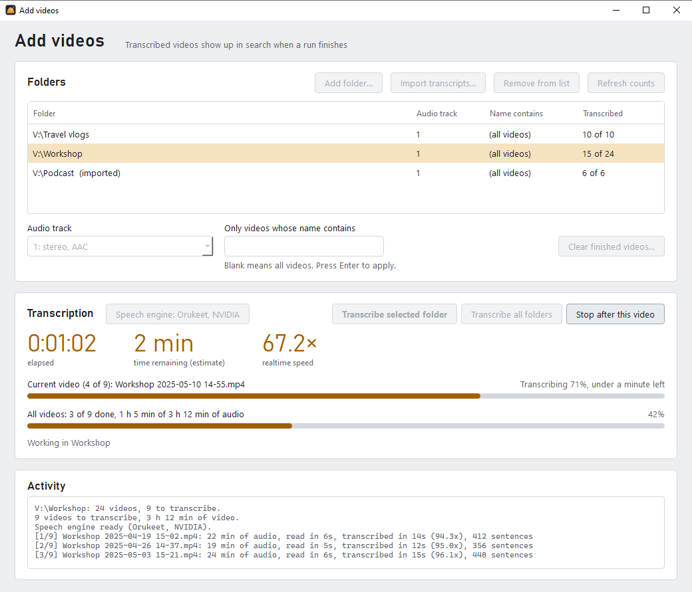
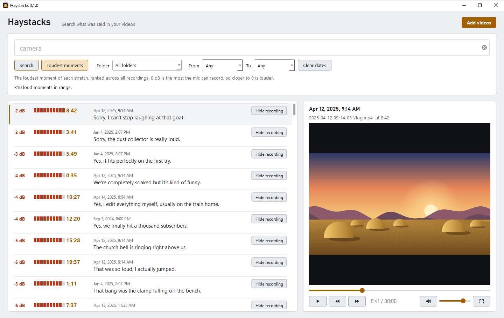

# Haystacks

Find the needle: search everything that was said across hours of video.

Haystacks is a Windows desktop app that transcribes whole folders of videos
on your own PC, then lets you search what was said and jump straight to that
moment in a built-in player. Nothing is uploaded anywhere; transcription runs
locally with the [Orukeet](https://github.com/Oruk-AI/orukeet) speech
recognition engine, or a Whisper model if you prefer.

<picture>
  <source media="(prefers-color-scheme: dark)" srcset="docs/screenshots/search-dark.png">
  
</picture>

## Features

- **Transcribe folders of videos.** Add a folder, pick which audio track to
  use, and press Transcribe. Finished videos are skipped, so you can stop at
  any time and continue later. Progress, time remaining and speed are shown
  as it runs.
- **Search as you type.** All words must appear in the same sentence; use
  quotes for an exact phrase. Each hit shows the sentences around it.
- **Play the moment.** Click a result to play the video from just before that
  sentence, or open it in another player (VLC if installed).
- **Loudest moments.** A ranked list of the loudest moments across all your
  recordings, with what was being said at the time.
- **Filter and sort** by folder and date, newest, oldest or loudest first,
  and hide recordings you don't want in results.
- **Import existing transcripts** instead of re-transcribing: Haystacks JSON,
  Whisper JSON (openai-whisper, faster-whisper, whisper.cpp), and `.srt` /
  `.vtt` subtitles named like the videos (`clip.srt` or `clip.en.srt` for
  `clip.mp4`). Imported files are read in place and never changed.
- **Search YouTube videos** by what is said in them. Paste a link to a video,
  playlist or channel under **Add videos > Add YouTube...** and Haystacks
  fetches the subtitles YouTube already has (the uploader's own, or else
  YouTube's automatic captions; a few KB per video, no video is downloaded).
  Results play in the built-in player, with the same controls. See
  [YouTube videos](#youtube-videos).
- **Link your own transcripts to YouTube.** Have a transcript of a video
  that's on YouTube? **Add videos > Link to YouTube...** pairs the file with
  the video's link, and its results play the YouTube video.
- **Updates itself.** When a new version is out, a banner offers to install
  it with one click.
- Video formats: `.mp4`, `.mkv`, `.mov`, `.avi`, `.mts`, `.m4v`, `.webm`.
- Light and dark theme, following your Windows setting.

<picture>
  <source media="(prefers-color-scheme: dark)" srcset="docs/screenshots/add-videos-dark.png">
  
</picture>

<picture>
  <source media="(prefers-color-scheme: dark)" srcset="docs/screenshots/loudest-dark.png">
  
</picture>

## Install

1. Download `Haystacks-Setup-<version>.exe` from the
   [latest release](https://github.com/CyprianCode/Haystacks/releases/latest).
2. Run it. It installs for your Windows user only, so no administrator
   rights are needed.

   The installer isn't code-signed yet, so Windows may show "Windows
   protected your PC". Click **More info**, then **Run anyway**.
3. Start Haystacks from the Start menu. The first time you transcribe, it
   downloads the speech engine (about 750 to 850 MB, once). It picks the
   fastest engine for your PC, and you can switch later under **Add videos >
   Speech engine**:
   - **NVIDIA graphics card (CUDA):** hundreds of times faster than real time.
   - **Other graphics cards (Vulkan),** such as AMD and Intel: several times
     faster than the CPU.
   - **CPU only:** works everywhere, just slower.

### Choosing a speech model

Orukeet is the default and is recommended for English and 24 other European
languages. In **Add videos > Speech engine** you can switch to another model
(each is downloaded once, when first chosen):

| Model | Good for | Download |
|---|---|---|
| **Orukeet** (recommended) | English and European languages; fastest | ~800 MB |
| **Whisper large-v3-turbo** | 99 languages, very accurate | 574 MB + engine |
| **Whisper small** | 99 languages on slower PCs; less accurate | 190 MB + engine |
| **Distil-Whisper large-v3** | English only, faster than full Whisper | 1.5 GB + engine |
| **Custom Whisper model** | Any [whisper.cpp](https://github.com/ggml-org/whisper.cpp) model file (`.bin`), e.g. one fine-tuned for your language; a file on your PC or a download link | varies |
| **Custom command** | Any speech program you already use | none |

Whisper models run with [whisper.cpp](https://github.com/ggml-org/whisper.cpp)
(engine download: 9 MB for the CPU, about 675 MB for NVIDIA cards). They use
NVIDIA graphics cards or the CPU; on AMD and Intel graphics Orukeet is much
faster. Whisper models let you set the spoken language or detect it.

**Custom command:** enter a command line with `{input}` and `{output}`, for
example `"C:\Tools\my-asr.exe" --audio {input} --out {output}`. `{input}` is
a 16 kHz mono WAV file; `{output}` is a path without an extension, and the
program must write `{output}.json` (Whisper or whisper.cpp JSON),
`{output}.srt` or `{output}.vtt`. Haystacks tests the command on two seconds
of silence before using it.

Switching models doesn't change videos that are already transcribed; use
"Clear finished videos..." to redo a folder with the new model.

Requirements: 64-bit Windows 10 or 11. Searching imported transcripts works
without the speech engine.

### YouTube videos

**Add videos > Add YouTube...** takes a link to a single video, a playlist or a
channel, and a subtitle language. Haystacks downloads
[yt-dlp](https://github.com/yt-dlp/yt-dlp) the first time (about 18 MB, kept
up to date automatically), then fetches one subtitle file per video. Select the
YouTube entry and press **Get new subtitles** (or **Transcribe all folders**) at
any time to add new uploads; videos already fetched are skipped.

- Videos without subtitles in that language are skipped and tried again on
  later runs (automatic captions can take a few hours to appear after upload).
- Automatic captions have more mistakes than the speech engine, and sometimes
  no punctuation.
- Playing needs an internet connection. A few videos can't be played outside
  YouTube by their owner's choice; right-click a result and choose **Open on
  YouTube** to watch it there, at the same moment.
- YouTube limits how fast subtitles can be fetched. For a big channel it may
  stop partway with a message; what was fetched is kept, and running it again
  later continues.
- YouTube videos have no loudness data, so they don't appear in Loudest
  moments.

**Transcripts you already have:** **Add videos > Link to YouTube...** takes a
transcript file (Haystacks or Whisper JSON, `.srt` or `.vtt`) and the link to
the video on YouTube. The file is read where it is and never changed; its
folder is added to the list like imported transcripts. You can also
right-click any result and choose **Link to YouTube video...** (or **Change**
/ **Remove YouTube link**). If the video file is also on your PC, results
still play it from there, and **Open on YouTube** is in the right-click menu.
Transcript files named like yt-dlp's (`<title> [<video id>].en.vtt`) are
linked automatically when imported. The transcript's timings must match the
uploaded video: a transcript of a longer or edited recording will be off.

## Where things are stored

- **Transcripts** for each folder go in a `_Haystacks` folder inside it:
  `<stem>.json` per video, plus `_loudness\` (loudness data) and
  `_failed.txt` (if a video couldn't be transcribed). No audio files are
  kept; audio is decoded from the video into memory.
- **YouTube subtitles** go in `%LOCALAPPDATA%\Haystacks\YouTube\<name>` (or
  the folder you chose): one `.vtt` per video, named
  `<upload date> <title> [<video id>].<language>.vtt`, plus `_youtube.json`
  (videos that had no subtitles).
- **Settings** (folder list, hidden recordings, window layout):
  `%APPDATA%\Haystacks\settings.json`.
- **The app** is installed in `%LOCALAPPDATA%\Programs\Haystacks`.
- **The speech engine** is stored in `%LOCALAPPDATA%\Haystacks\engine`, and
  yt-dlp in `%LOCALAPPDATA%\Haystacks\engine\yt-dlp`.
- "Clear finished videos..." in Add videos deletes only the files Haystacks
  wrote in `_Haystacks`, never your videos.
- Uninstalling (Windows Settings > Apps) removes the app, the speech engine
  and yt-dlp; your videos, transcripts, YouTube subtitles and settings stay.

## Run from source

For development. Run these in PowerShell:

```powershell
winget install Python.Python.3.13 Git.Git
cd $HOME\Documents
git clone https://github.com/CyprianCode/Haystacks.git
cd Haystacks
py -3.13 -m venv .venv
.\.venv\Scripts\python.exe -m pip install -r requirements.txt
.\.venv\Scripts\pythonw.exe Haystacks.pyw
```

The speech engine is set up from inside the app on first use, as above.
`powershell -ExecutionPolicy Bypass -File .\make_shortcut.ps1` creates a
desktop shortcut to the source version.

## Building and releasing

- **Build an installer locally:**

  ```powershell
  winget install JRSoftware.InnoSetup
  powershell -ExecutionPolicy Bypass -File .\build.ps1
  ```

  This produces `dist\Haystacks-Setup-<version>.exe`.
- **Publish a release:**
  1. Set the new number in `version.py`, for example `0.2.0`.
  2. Commit, then tag and push:

     ```powershell
     git commit -am "Release 0.2.0"
     git tag v0.2.0
     git push origin main v0.2.0
     ```

  The [Release workflow](.github/workflows/release.yml) builds the installer
  and publishes it on GitHub. Installed copies offer the update within a
  day.

## Project layout

| File | Role |
|---|---|
| `Haystacks.pyw` | Entry point: settings, theme, crash dialog. |
| `search_window.py` | Main window: search, filters, results list, Loudest moments. |
| `player.py` | Built-in video player panel. |
| `youtube.py` | Fetching YouTube subtitles with yt-dlp. |
| `youtube_view.py` | Playing YouTube videos in the player panel (Qt WebEngine). |
| `transcribe_window.py` | "Add videos" window: folders, audio tracks, transcription progress, importing, adding YouTube videos. |
| `engine.py`, `engine_dialog.py` | Choosing, downloading and testing the speech model and engine. |
| `asr_external.py` | Runs whisper.cpp or a custom command as the speech engine. |
| `updater.py`, `update_banner.py` | Checking GitHub for new versions and installing them. |
| `pipeline.py` | Reading audio (PyAV), transcribing, loudness, output files. |
| `search_data.py` | Turns a folder of transcripts into search data. |
| `library.py` | Search logic, independent of the UI. |
| `transcripts.py` | Reads every importable transcript format. |
| `measure.py` | Background loudness and date measuring for imported folders. |
| `theme.py` | Colors, fonts, stylesheet and icons. |
| `paths.py`, `version.py` | Where files live; the version number. |
| `haystacks.spec`, `installer.iss`, `build.ps1` | Building the app and its installer. |
| `tools/third_party.py` | Writes the license notices bundled with the installer. |
| `assets/` | The app icon and the script that draws it. |
| `docs/screenshots/` | Screenshots for this README (light and dark), taken with made-up demo recordings. |

## License

Haystacks is free software, licensed under the
[GNU General Public License v3.0](LICENSE).

The installer includes Python, [PySide6 / Qt](https://www.qt.io/qt-for-python)
(LGPL-3.0) including Qt WebEngine (Chromium, BSD-3-Clause and others),
[NumPy](https://numpy.org) (BSD-3-Clause),
[PyAV](https://pyav.org) (BSD-3-Clause) with [FFmpeg](https://ffmpeg.org)
(LGPL-2.1-or-later), and [Orukeet](https://github.com/Oruk-AI/orukeet)'s
Python package (MIT). Their full license texts are in
`THIRD-PARTY-LICENSES.txt` next to the installed app.

The Orukeet speech model is downloaded on first use and is licensed
[CC BY-SA 4.0](https://creativecommons.org/licenses/by-sa/4.0/). It is based
on NVIDIA Parakeet TDT 0.6B v3. The optional Whisper models, Distil-Whisper
and whisper.cpp are downloaded only if chosen, and are licensed MIT.
[yt-dlp](https://github.com/yt-dlp/yt-dlp) is downloaded only when YouTube
videos are added, and is released under the Unlicense.
